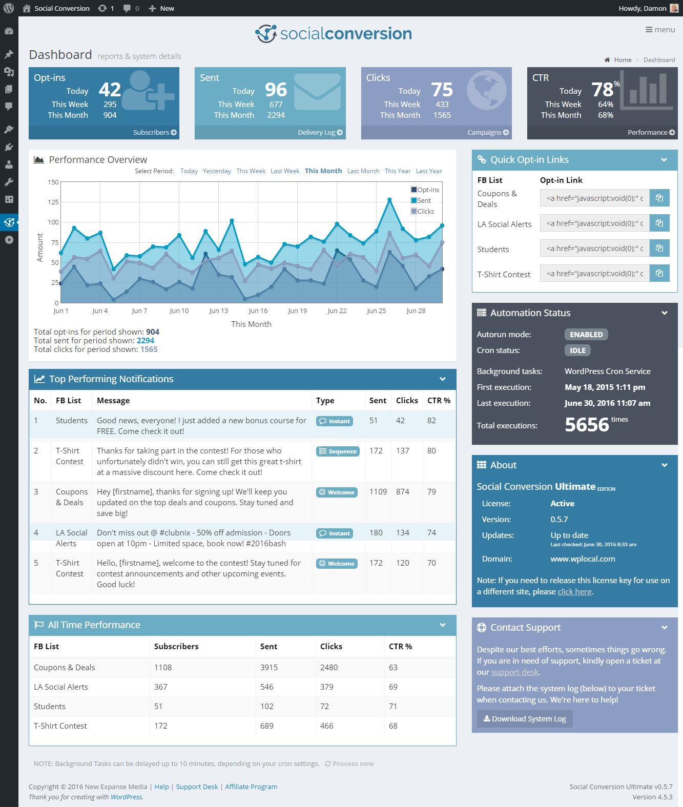
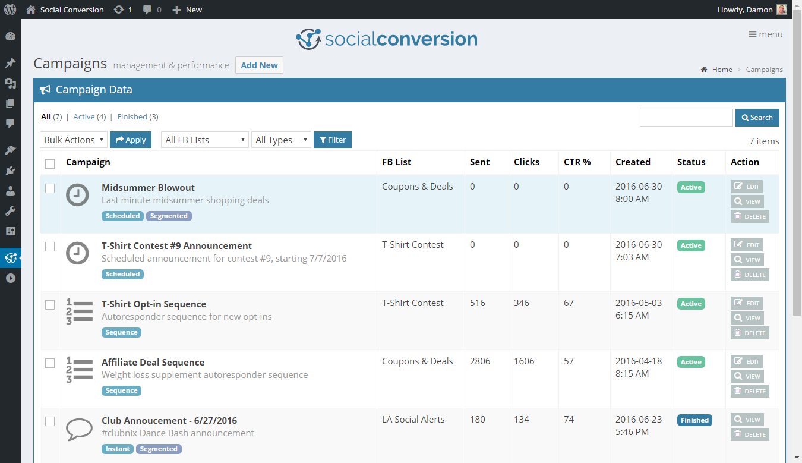
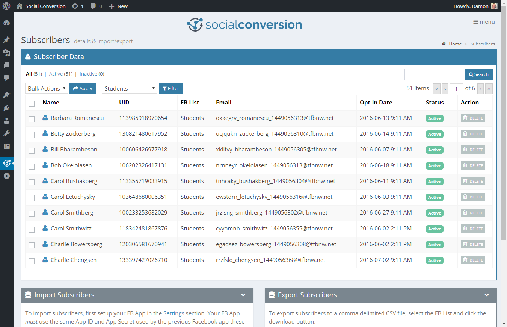

   
  
    

**A WordPress Plugin for Advanced Facebook Marketing Automation**

## Overview

Social Conversion is a self-hosted WordPress plugin that empowers marketers with advanced Facebook lead engagement tools. Developed in 2016, it enabled businesses to create and manage targeted campaigns through Facebook Notifications while integrating seamlessly with 11 popular autoresponder platforms. With powerful segmentation tools and detailed analytics, Social Conversion offered marketers unparalleled reach, engagement, and conversion potential.

⚠️ **Note:** This plugin is no longer maintained and may not work with modern WordPress or Facebook APIs. It is provided as-is for portfolio purposes.

## Key Features

-   **Automated Campaigns**: Send instant, scheduled, or follow-up sequence messages, similar to an email autoresponder.
-   **Subscriber Management**: Build and segment subscriber lists by demographics, behavior, and more.
-   **Real Email Capture**: Automatically collect verified email addresses from Facebook users and sync with autoresponders.
-   **11 Autoresponder Integrations**: Native support for platforms like MailChimp, ActiveCampaign, AWeber, and more.
-   **Custom Opt-In Tools**: Generate graphical opt-in buttons and links for use across websites, emails, and social platforms.
-   **Detailed Analytics**: Gain insights into delivery rates, click performance, and campaign success.

## Screenshots

### Dashboard Overview

### Campaign Management

### Subscribers Overview

## Technical Highlights

-   **Built With**: PHP, JavaScript, MySQL, WordPress Plugin API, and Facebook Graph API.
-   **Core Concepts**:
    -   Advanced use of WordPress hooks and filters.
    -   Interaction with Facebook APIs for notifications and user data.
    -   Automation of marketing workflows.
-   **Dashboard Design**: Modern and intuitive interface featuring clean stats and performance summaries.

## Legacy Impact

At its peak, Social Conversion provided:

-   **Higher Engagement**: By leveraging Facebook Notifications, marketers saw significantly higher open rates compared to traditional email marketing.
-   **Enhanced Lead Nurturing**: A platform to foster trust, credibility, and ongoing customer relationships.
-   **Streamlined Operations**: Combining multiple marketing tasks into one cohesive, user-friendly system.

## Features in Depth

1. **Facebook Notification Campaigns**:

    - Send targeted notifications to lists or segments.
    - Include personalized messages and redirect links for higher engagement.

2. **Subscriber Insights**:

    - Collect and manage data like email, full name, gender, locale, and Facebook profile links.
    - Import/export subscriber lists for analysis or backup.

3. **Advanced Segmentation**:

    - Segment audiences by gender, locale, action history, and custom lists.

4. **Autoresponder Integrations**:

    - Automatically sync Facebook opt-ins with email lists on services like GetResponse, Constant Contact, and MailChimp.

5. **Performance Tracking**:

    - Monitor opt-in rates, message delivery stats, and click-through metrics.

6. **Custom Opt-In Tools**:
    - Create professional opt-in buttons or links with provided designs or your own.

## Why It Matters

Social Conversion was designed to solve a critical marketing challenge: the declining visibility of Facebook posts and the limited effectiveness of email marketing. By using Facebook Notifications, marketers could:

-   Overcome the **news feed invisibility problem**.
-   Achieve **higher open rates** with a direct-to-user messaging channel.
-   Build **trust and credibility** through ongoing engagement.
-   Save money by improving ROI on existing traffic sources.

## Disclaimer

Social Conversion is no longer actively developed or supported. As Facebook's notification alert system has changed, the plugin may not work with modern APIs. This project is shared for **portfolio purposes only** to showcase expertise in WordPress plugin development and advanced marketing automation tools.

## Contact

For more details about this project or to explore my portfolio, feel free to reach out:

-   **Email**: hello@damon.codes
-   **Portfolio**: https://damon.codes

## License

This plugin is licensed under the GNU General Public License v2.0. See the [LICENSE.md](LICENSE.md) file for details.

## About the Developer

Social Conversion was conceived, designed, and developed solely by Damon Malkiewicz, a software developer and marketing specialist with over 20 years of experience. With expertise in PHP, JavaScript, MySQL, and WordPress development, Damon created this project to address real-world marketing challenges. It reflects his commitment to building tools that help businesses improve efficiency and engagement in their workflows.
